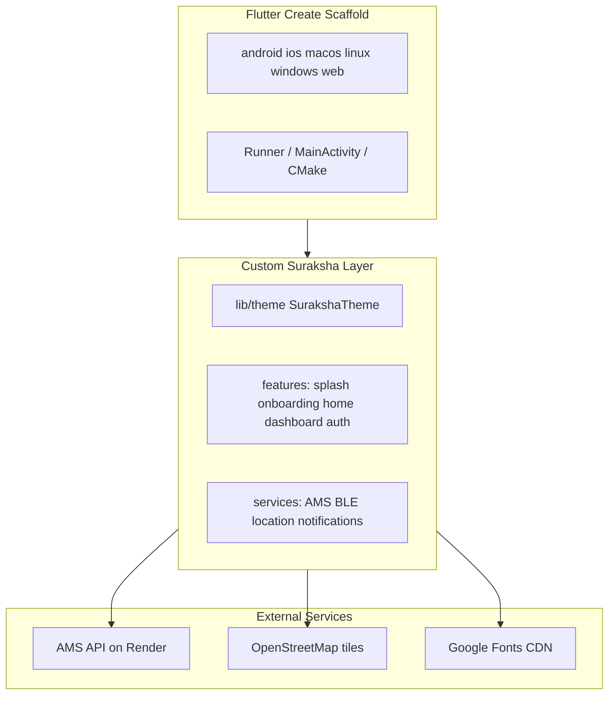

# Suraksha App — Full Dependency & Template Audit

This is a **Flutter/Dart-only** project. There is no `package.json`, `requirements.txt`, `Gemfile`, or `composer.json`. All Dart dependencies are declared in [`pubspec.yaml`](../pubspec.yaml) with resolved versions in [`pubspec.lock`](../pubspec.lock).

**SDK constraints (lockfile):** Dart `>=3.10.0 <4.0.0`, Flutter `>=3.35.6`  
**Flutter channel (`.metadata`):** stable, revision `00b0c91f06209d9e4a41f71b7a512d6eb3b9c694`

---

## 1. Summary Table

| Name | Version (resolved) | Category | One-line purpose |
|------|-------------------|----------|------------------|
| Flutter SDK | stable (see `.metadata`) | Framework | Cross-platform UI runtime and Material widgets |
| flutter_riverpod | 2.6.1 | State management | App-wide reactive state via `Provider` / `StateNotifier` |
| riverpod_annotation | 2.6.1 | Code-gen (unused) | Annotations for `@riverpod` codegen — declared but not used |
| go_router | 14.8.1 | Navigation | Declarative routing (`GoRouter`, `CustomTransitionPage`) |
| google_fonts | 6.3.3 | Fonts | Loads Inter, Playfair Display, DM Mono at runtime |
| geolocator | 12.0.0 | Location | GPS position + permission prompts |
| geocoding | 3.0.0 | Location | Reverse geocode lat/lng to address labels |
| shared_preferences | 2.5.5 | Local storage | Key-value prefs (auth session, onboarding flags) |
| flutter_secure_storage | 9.2.4 | Secure storage (unused) | Encrypted key-value — plugin registered, no Dart usage |
| http | 1.6.0 | Networking | REST client for AMS backend |
| url_launcher | 6.3.2 | Platform integration | Open `tel:` / external URLs from contact sheet |
| permission_handler | 11.4.0 | Permissions (unused) | Runtime permission API — not imported; geolocator handles location |
| intl | 0.19.0 | i18n/formatting (unused) | Date/number formatting — no imports |
| uuid | 4.5.3 | Utilities (unused) | UUID generation — no imports |
| collection | 1.19.1 | Utilities (unused) | Collection helpers — no direct imports |
| visibility_detector | 0.4.0+2 | UI (unused) | Scroll visibility callbacks — no imports |
| marquee | 2.3.0 | UI animation | Infinite horizontal text scroll on marketing home |
| shimmer | 3.0.0 | UI animation (unused) | Skeleton shimmer — no imports (custom gradient shimmer in splash) |
| smooth_page_indicator | 1.2.1 | UI | Onboarding page dots |
| flutter_svg | 2.3.0 | Vector graphics (unused) | SVG rendering — no imports |
| flutter_blue_plus | 1.36.8 | BLE / IoT | Scan/connect Suraksha wristband over Bluetooth |
| battery_plus | 7.1.0 | Device info (unused) | Native battery level — replaced by custom `BatteryIndicator` painter |
| flutter_local_notifications | 17.2.4 | Notifications | SOS ongoing + sent local notifications |
| flutter_map | 8.3.0 | Maps | Interactive map widget for tracking dashboard |
| latlong2 | 0.9.1 | Maps / geo | `LatLng` type + distance math for geocoding cache |
| flutter_test | SDK | Testing | Widget test harness |
| riverpod_generator | 2.6.5 | Code-gen (unused) | Generates Riverpod providers — no `@riverpod` in codebase |
| build_runner | 2.5.4 | Build tool (unused) | Runs code generators — only needed if codegen is used |
| flutter_lints | 4.0.0 | Linting | Analyzer rules via [`analysis_options.yaml`](../analysis_options.yaml) |
| Material Design | Flutter built-in | UI framework | `uses-material-design: true`; dark theme in `SurakshaTheme` |
| OpenStreetMap tiles | N/A (HTTP service) | Map tiles | `https://tile.openstreetmap.org/{z}/{x}/{y}.png` |
| AMS API (Render) | N/A (hosted backend) | Backend | `https://ams-omwj.onrender.com` — auth + SOS dispatch |
| desugar_jdk_libs | 2.1.4 | Android build | Core library desugaring for notifications on older Android |
| Android Gradle Plugin | 8.11.1 | Android build | Via [`android/settings.gradle.kts`](../android/settings.gradle.kts) |
| Kotlin | 2.2.20 | Android build | JVM target 17 in [`android/app/build.gradle.kts`](../android/app/build.gradle.kts) |
| CocoaPods | iOS 13.0 min | iOS/macOS build | [`ios/Podfile`](../ios/Podfile) |

---

## 2. Detailed Breakdown

### Flutter SDK
- **Version:** stable channel, revision `00b0c91f06209d9e4a41f71b7a512d6eb3b9c694` ([`.metadata`](../.metadata))
- **Category:** Framework / runtime
- **Purpose:** Hosts the Dart VM, rendering engine (Impeller enabled on Android via `AndroidManifest.xml`), and platform channels.
- **Where used:** Entire app; entry [`lib/main.dart`](../lib/main.dart) → [`lib/app.dart`](../lib/app.dart).
- **Integration:** `flutter pub get`; `ProviderScope` + `MaterialApp.router` in `app.dart`. Android Impeller: `io.flutter.embedding.android.EnableImpeller=true`.
- **Add usage:** Standard Flutter widget/feature development under `lib/`.
- **Update/remove:** `flutter upgrade`; removing Flutter removes the project.
- **Flags:** None.

### flutter_riverpod (2.6.1)
- **Category:** State management
- **Purpose:** Dependency injection and reactive state (`Provider`, `StateNotifierProvider`, `ConsumerWidget`).
- **Where used:** [`lib/main.dart`](../lib/main.dart), [`lib/app.dart`](../lib/app.dart), [`lib/router/app_router.dart`](../lib/router/app_router.dart), all providers in `lib/services/`, [`lib/features/auth/auth_provider.dart`](../lib/features/auth/auth_provider.dart), [`lib/features/dashboard/dashboard_provider.dart`](../lib/features/dashboard/dashboard_provider.dart), [`lib/features/home/home_controller.dart`](../lib/features/home/home_controller.dart), and 20+ feature widgets.
- **Integration:** `ProviderScope` wraps app in `main.dart`. Pattern: manual `final xProvider = Provider<...>((ref) => ...)`.
- **Add usage:** Create a provider file following [`lib/services/location_service.dart`](../lib/services/location_service.dart) or [`lib/features/auth/auth_provider.dart`](../lib/features/auth/auth_provider.dart); `ref.watch` / `ref.read` in widgets.
- **Update/remove:** `flutter pub upgrade flutter_riverpod`. Removal breaks all state/navigation wiring.
- **Flags:** None. Uses manual providers, not codegen.

### go_router (14.8.1)
- **Category:** Navigation
- **Purpose:** URL-based routing with redirects and custom page transitions.
- **Where used:** [`lib/router/app_router.dart`](../lib/router/app_router.dart), auth/onboarding/splash screens, [`lib/widgets/navigation/suraksha_navbar.dart`](../lib/widgets/navigation/suraksha_navbar.dart).
- **Integration:** `appRouterProvider` → `MaterialApp.router(routerConfig: router)` in `app.dart`. Routes defined in [`lib/router/app_routes.dart`](../lib/router/app_routes.dart).
- **Add usage:** Add `GoRoute` in `app_router.dart` + path constant in `app_routes.dart`; navigate with `context.go(AppRoutes.x)`.
- **Update/remove:** `flutter pub upgrade go_router`. Removal requires replacing all routing.
- **Flags:** README lists `/evidence` route — **not implemented** in router (doc drift only).

### google_fonts (6.3.3)
- **Category:** Fonts
- **Purpose:** Downloads and caches Google Font families at runtime.
- **Where used:** [`lib/theme/suraksha_typography.dart`](../lib/theme/suraksha_typography.dart) (primary), plus [`lib/widgets/suraksha_input.dart`](../lib/widgets/suraksha_input.dart), [`lib/widgets/origin_button.dart`](../lib/widgets/origin_button.dart), splash wordmark/brand panel, email input, label.
- **Fonts in use:** Inter, Playfair Display, DM Mono.
- **Integration:** `GoogleFonts.inter()` etc. in typography theme; no `pubspec` font assets.
- **Add usage:** `GoogleFonts.<family>()` or extend `SurakshaTypography`.
- **Update/remove:** `flutter pub upgrade google_fonts`. Requires network on first font load.
- **Flags:** None.

### geolocator (12.0.0) + geocoding (3.0.0) + latlong2 (0.9.1)
- **Category:** Location
- **Purpose:** `geolocator` fetches GPS; `geocoding` resolves placemarks; `latlong2` provides `LatLng` and `Distance` for geocode caching.
- **Where used:** [`lib/services/location_service.dart`](../lib/services/location_service.dart), consumed by [`lib/features/dashboard/live_location_tracker.dart`](../lib/features/dashboard/live_location_tracker.dart), [`lib/features/dashboard/tracking/tracking_map_view.dart`](../lib/features/dashboard/tracking/tracking_map_view.dart).
- **Integration:** iOS `NSLocationWhenInUseUsageDescription` in [`ios/Runner/Info.plist`](../ios/Runner/Info.plist); Android location permissions in [`android/app/src/main/AndroidManifest.xml`](../android/app/src/main/AndroidManifest.xml). No `permission_handler` — geolocator's own permission API is used.
- **Add usage:** Call `locationServiceProvider` methods from a Riverpod consumer.
- **Update/remove:** Upgrade all three together if map/geo APIs change. Removal breaks live tracking and SOS location payload.
- **Flags:** `permission_handler` is redundant while geolocator handles location permissions.

### flutter_map (8.3.0)
- **Category:** Maps
- **Purpose:** Renders slippy map with tile layers, markers, circles.
- **Where used:** [`lib/features/dashboard/tracking/tracking_map_view.dart`](../lib/features/dashboard/tracking/tracking_map_view.dart) via [`dark_map_widget.dart`](../lib/features/dashboard/tracking/widgets/dark_map_widget.dart).
- **Integration:** `TileLayer` points to OpenStreetMap; dark mode via `ColorFilter.matrix`. `userAgentPackageName: com.suraksha.suraksha`. OSM attribution string in [`lib/core/constants/copy_constants.dart`](../lib/core/constants/copy_constants.dart).
- **Add usage:** Extend `FlutterMap` children (layers/markers) in `tracking_map_view.dart`.
- **Update/remove:** `flutter pub upgrade flutter_map`. Must comply with [OSM tile usage policy](https://operations.osmfoundation.org/policies/tiles/).
- **Flags:** None.

### http (1.6.0)
- **Category:** Networking / backend client
- **Purpose:** JSON REST calls to AMS API.
- **Where used:** [`lib/services/ams_api_service.dart`](../lib/services/ams_api_service.dart) — login, SOS to police dashboard.
- **Integration:** Base URL hardcoded in [`lib/core/constants/app_constants.dart`](../lib/core/constants/app_constants.dart): `amsBaseUrl = 'https://ams-omwj.onrender.com'`. No env files.
- **Add usage:** Add methods on `AmsApiService` + expose via `amsApiServiceProvider`.
- **Update/remove:** Safe to upgrade. Removal breaks remote auth/SOS unless replaced.
- **Flags:** No Firebase/Supabase; custom Render-hosted AMS only.

### shared_preferences (2.5.5)
- **Category:** Local storage
- **Purpose:** Persists login flag, user profile fields, onboarding state, pending signup.
- **Where used:** [`lib/features/auth/auth_provider.dart`](../lib/features/auth/auth_provider.dart), [`lib/router/app_router.dart`](../lib/router/app_router.dart), [`lib/features/onboarding/onboarding_screen.dart`](../lib/features/onboarding/onboarding_screen.dart), [`lib/features/splash/splash_screen2.dart`](../lib/features/splash/splash_screen2.dart).
- **Integration:** `SharedPreferences.getInstance()`; keys in `AppConstants` + ad-hoc `user_*` keys.
- **Add usage:** `prefs.setBool/setString` in providers; read on restore.
- **Update/remove:** Standard plugin upgrade. Removal loses session persistence.
- **Flags:** Overlaps conceptually with `flutter_secure_storage` for sensitive data — but secure storage is unused and passwords are stored in plain prefs during pending signup.

### flutter_blue_plus (1.36.8)
- **Category:** BLE / IoT
- **Purpose:** BLE scan, connect, and forward wristband double-tap SOS events.
- **Where used:** [`lib/services/ble_service.dart`](../lib/services/ble_service.dart), triggered from [`lib/features/dashboard/tabs/profile_tab.dart`](../lib/features/dashboard/tabs/profile_tab.dart); SOS flow in [`lib/features/dashboard/tabs/sos_tab.dart`](../lib/features/dashboard/tabs/sos_tab.dart) via [`lib/services/wristband_sos_service.dart`](../lib/services/wristband_sos_service.dart).
- **Integration:** Android `BLUETOOTH_SCAN` + `BLUETOOTH_CONNECT` in manifest. Native plugins via generated registrants.
- **Add usage:** Extend `BleService` and wire characteristic reads to `WristbandSosService.notifyBandDoubleTap()`.
- **Update/remove:** BLE API changes between major versions — test on device after upgrade.
- **Flags:** None.

### flutter_local_notifications (17.2.4)
- **Category:** Notifications
- **Purpose:** Shows ongoing SOS notification and post-dispatch alert.
- **Where used:** [`lib/services/notification_service.dart`](../lib/services/notification_service.dart); init in [`lib/app.dart`](../lib/app.dart); SOS tab calls `showSosOngoing` / `cancelSosNotification`.
- **Integration:** Android channel `suraksha_sos`; requires core library desugaring (`desugar_jdk_libs:2.1.4` in Android Gradle).
- **Add usage:** Add methods on `NotificationService` + call from feature code.
- **Update/remove:** Upgrade with Android desugaring compatibility check.
- **Flags:** None.

### marquee (2.3.0)
- **Category:** UI animation
- **Purpose:** Dual-layer perspective marquee on marketing home.
- **Where used:** [`lib/features/home/sections/perspective_marquee_section.dart`](../lib/features/home/sections/perspective_marquee_section.dart).
- **Integration:** Direct `Marquee` widget usage.
- **Add usage:** Wrap text in `Marquee(...)` as in that file.
- **Update/remove:** Low risk.
- **Flags:** None.

### smooth_page_indicator (1.2.1)
- **Category:** UI
- **Purpose:** Animated dots for onboarding `PageView`.
- **Where used:** [`lib/features/onboarding/widgets/onboarding_indicator.dart`](../lib/features/onboarding/widgets/onboarding_indicator.dart).
- **Integration:** `SmoothPageIndicator` bound to `PageController`.
- **Add usage:** Copy onboarding indicator pattern.
- **Update/remove:** Low risk.
- **Flags:** None.

### url_launcher (6.3.2)
- **Category:** Platform integration
- **Purpose:** Launch phone dialer from contact detail sheet.
- **Where used:** [`lib/features/dashboard/tracking/widgets/contact_detail_sheet.dart`](../lib/features/dashboard/tracking/widgets/contact_detail_sheet.dart).
- **Integration:** `launchUrl(Uri.parse('tel:...'))`.
- **Add usage:** Import `url_launcher` and call `launchUrl`.
- **Update/remove:** Low risk.
- **Flags:** None.

### flutter_test (SDK) + flutter_lints (4.0.0)
- **Category:** Testing / linting
- **Purpose:** Widget tests; static analysis rules.
- **Where used:** [`test/widget_test.dart`](../test/widget_test.dart); lints via [`analysis_options.yaml`](../analysis_options.yaml) (`include: package:flutter_lints/flutter.yaml`).
- **Integration:** `flutter test`; `flutter analyze`.
- **Add usage:** Add tests under `test/`; customize `analysis_options.yaml`.
- **Update/remove:** `flutter pub upgrade flutter_lints`.
- **Flags:** Minimal test coverage (1 smoke test).

### riverpod_annotation + riverpod_generator + build_runner
- **Versions:** 2.6.1 / 2.6.5 / 2.5.4
- **Category:** Code generation (unused stack)
- **Purpose:** Would generate type-safe `@riverpod` providers.
- **Where used:** **Nowhere** — no `@riverpod` annotations; all providers are hand-written `Provider` / `StateNotifierProvider`.
- **Integration:** Declared in pubspec but `dart run build_runner build` is never required.
- **Add usage:** Annotate providers + run `dart run build_runner build --delete-conflicting-outputs`.
- **Update/remove:** Safe to remove all three if staying on manual Riverpod (reduces dev deps and lockfile size).
- **Flags:** ⚠️ **Unused dead dev stack** — duplicates manual provider pattern already in use.

### flutter_secure_storage (9.2.4)
- **Category:** Secure storage
- **Purpose:** Keychain/Keystore-backed secrets.
- **Where used:** **No Dart imports.** Native plugin still registered in [`macos/Flutter/GeneratedPluginRegistrant.swift`](../macos/Flutter/GeneratedPluginRegistrant.swift), Linux/Windows generated registrants.
- **Integration:** None in app code; auth uses `shared_preferences` including `pending_signup_password`.
- **Add usage:** `FlutterSecureStorage()` for tokens/passwords; migrate off plain prefs.
- **Update/remove:** ⚠️ Safe to remove from pubspec if not planning secure storage — reduces native binary/plugin surface.
- **Flags:** ⚠️ **Unused**; ⚠️ **security gap** — README mentions encryption but implementation uses plain SharedPreferences.

### permission_handler (11.4.0)
- **Flags:** ⚠️ **Unused** — geolocator handles location; BLE permissions are manifest-only so far.

### battery_plus (7.1.0)
- **Flags:** ⚠️ **Unused in Dart** — [`lib/features/dashboard/tracking/widgets/battery_indicator.dart`](../lib/features/dashboard/tracking/widgets/battery_indicator.dart) is a custom painter; `dashboard_provider` uses hardcoded `batteryLevel: 87`.

### flutter_svg (2.3.0)
- **Flags:** ⚠️ **Unused** — no `SvgPicture` imports; UI uses Material icons, PNG avatars, CustomPaint.

### shimmer (3.0.0)
- **Flags:** ⚠️ **Unused** — splash wordmark uses manual `shimmerPos` gradient, not the `shimmer` package.

### visibility_detector (0.4.0+2)
- **Flags:** ⚠️ **Unused** — home parallax uses scroll offset from [`lib/features/home/home_controller.dart`](../lib/features/home/home_controller.dart), not visibility callbacks.

### intl, uuid, collection
- **Flags:** ⚠️ **Unused** direct dependencies — likely added for planned features; no `lib/` imports found.

### Custom in-repo UI (not packages)
- **Suraksha theme** ([`lib/theme/`](../lib/theme/)): colors, spacing, typography, animations — no external UI kit.
- **OriginButton** ([`lib/widgets/origin_button.dart`](../lib/widgets/origin_button.dart)): custom radial-fill CTA (ported in-repo, not a pub package).
- **Shadcn-inspired widgets** ([`lib/widgets/suraksha_input.dart`](../lib/widgets/suraksha_input.dart), [`lib/widgets/suraksha_label.dart`](../lib/widgets/suraksha_label.dart)): comments reference shadcn styling; **not** the shadcn/ui npm library.
- **Material Icons:** default Flutter icon set.

### Third-party services (non-pub)
- **AMS API:** Render-hosted REST at `https://ams-omwj.onrender.com` — `/auth/login`, `/police/sos`, fallback `/sos/alert`.
- **OpenStreetMap:** tile CDN for map backgrounds.
- **Google Fonts CDN:** fetched by `google_fonts` package.

### Platform / native tooling
- **Android:** AGP 8.11.1, Kotlin 2.2.20, Java 17, `applicationId com.suraksha.suraksha`, desugaring enabled.
- **iOS:** CocoaPods, minimum platform 13.0, scene-based `SceneDelegate`.
- **Impeller:** explicitly enabled on Android.
- **Scripts (repo tooling, not runtime deps):** [`scripts/backfill_commits.sh`](../scripts/backfill_commits.sh), `push_develop.sh`, `push_phased.sh`, `install_hooks.sh` — git workflow helpers only.

### Assets declared but not loaded by code
- **`assets/models/wristband.glb`** in pubspec — splash wristband is [`CustomPaint`](../lib/features/splash/layers/splash_wristband.dart), not a 3D GLB viewer (no `model_viewer` or similar package).
- **PNG avatars** under `assets/images/avatars/` — used in map pin and dashboard mock data.

---

## 3. Templates / Boilerplate Origins

| Origin | Evidence | Notes |
|--------|----------|-------|
| **Flutter `flutter create` scaffold** | [`.metadata`](../.metadata) `project_type: app`; [`macos/Runner/Configs/AppInfo.xcconfig`](../macos/Runner/Configs/AppInfo.xcconfig) comment `// 'flutter create' template.`; [`web/manifest.json`](../web/manifest.json) `"A new Flutter project."`; earliest commits `ed97395 flutter project metadata`, `1ab0817 pubspec deps` | Standard multi-platform Runner layout (android/ios/macos/linux/windows/web). |
| **Custom Suraksha app** | Product-specific routes, splash painters, AMS integration, README | Not forked from a commercial Flutter template (no VGV Very Good Core, etc.). |
| **Shadcn UI (design reference only)** | Comments in `suraksha_input.dart`, `suraksha_label.dart`; git commit `f71d965 Created lib/widgets/suraksha_label.dart porting shadcn Label styling` | Visual patterns ported manually; **no shadcn package installed**. |
| **OriginButton** | Git commits `c381b63`–`98d7c15` | Custom in-repo widget, not an external dependency. |
| **README "Phase 3"** | Hive evidence encryption mentioned | **Not implemented** — Hive is absent from pubspec and codebase. |



---

## 4. Unused or Flagged Dependencies

| Package | Version | Flag | Recommendation |
|---------|---------|------|----------------|
| riverpod_annotation | 2.6.1 | ⚠️ Unused | Remove or adopt codegen |
| riverpod_generator | 2.6.5 | ⚠️ Unused dev | Remove with annotation |
| build_runner | 2.5.4 | ⚠️ Unused dev | Remove if no codegen |
| flutter_secure_storage | 9.2.4 | ⚠️ Unused + native plugin bloat | Remove or use for tokens/passwords |
| permission_handler | 11.4.0 | ⚠️ Unused | Remove (geolocator covers location) |
| battery_plus | 7.1.0 | ⚠️ Unused | Remove or wire to real device battery |
| flutter_svg | 2.3.0 | ⚠️ Unused | Remove unless adding SVG assets |
| shimmer | 3.0.0 | ⚠️ Unused | Remove |
| visibility_detector | 0.4.0+2 | ⚠️ Unused | Remove |
| intl | 0.19.0 | ⚠️ Unused | Remove until i18n/date formatting needed |
| uuid | 4.5.3 | ⚠️ Unused | Remove |
| collection | 1.19.1 | ⚠️ Unused direct dep | Remove (still available transitively) |
| shared_preferences for passwords | — | ⚠️ Security | Migrate secrets to flutter_secure_storage |
| Hive (README only) | — | ⚠️ Doc drift | Add package or update README |
| `/evidence` route (README only) | — | ⚠️ Doc drift | Implement or remove from README |

**Cleanup command (after review):**
```bash
# Example: remove unused direct deps from pubspec.yaml, then:
flutter pub get
flutter analyze
flutter test
```

---

## 5. Missing but Implied Dependencies

| Implied by | Missing from pubspec | Status |
|------------|---------------------|--------|
| README: "Hive evidence encryption" | `hive`, `hive_flutter` | **Not installed** — feature not implemented |
| README: `/evidence` route | N/A | Route absent from [`app_router.dart`](../lib/router/app_router.dart) |
| `pubspec.yaml` asset `wristband.glb` | 3D viewer (`model_viewer_plus`, `flutter_3d_obj`, etc.) | **Asset declared, no loader package** — dead asset unless 3D viewer added |
| `flutter_svg` in pubspec | SVG files in assets | No SVG assets referenced in code |
| Secure auth storage | — | `flutter_secure_storage` present but unused; passwords in SharedPreferences |
| No missing `import` packages found | — | All `package:` imports in `lib/` and `test/` resolve to pubspec or Flutter SDK |

**Verified import → manifest mapping (used packages):**

| Import | In pubspec? |
|--------|-------------|
| flutter_riverpod | Yes |
| go_router | Yes |
| google_fonts | Yes |
| geolocator, geocoding, latlong2 | Yes |
| shared_preferences | Yes |
| http | Yes |
| url_launcher | Yes |
| flutter_blue_plus | Yes |
| flutter_local_notifications | Yes |
| flutter_map | Yes |
| marquee | Yes |
| smooth_page_indicator | Yes |
| flutter_test | Yes (dev) |

---

*Last verified against `pubspec.lock` in the repository. Re-run import analysis and refresh resolved versions after dependency changes.*
